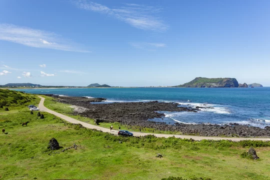
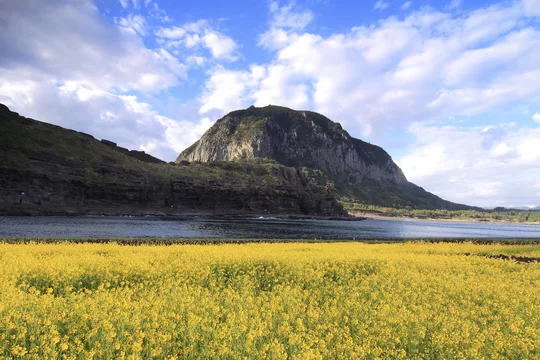

<!DOCTYPE html>
<html lang="ko">
<head>
    <meta charset="UTF-8">
    <meta name="viewport" content="width=device-width, initial-scale=1.0">
    <title>Wanderlust Travel - 제주도 감성 힐링 3박 4일 (A안)</title>
    <!-- Tailwind CSS & FontAwesome CDN -->
    
    <link rel="stylesheet" href="https://cdnjs.cloudflare.com/ajax/libs/font-awesome/6.4.0/css/all.min.css">
    <link href="https://fonts.googleapis.com/css2?family=Noto+Sans+KR:wght@400;500;700;800&display=swap" rel="stylesheet">
    
</head>
<body class="bg-gradient-to-br from-sky-50 via-slate-50 to-blue-50 text-slate-800 antialiased pb-20 min-h-screen">
    <!-- HEADER NAVIGATION -->
    <header class="bg-white/90 backdrop-blur-md border-b border-slate-200 sticky top-0 z-40 shadow-sm">
        

            

                

                    W
                

                WanderlustTravel
            

            <nav class="hidden md:flex space-x-8 font-medium text-sm text-slate-600">
                <a href="#overview" class="hover:text-sky-600">개요</a>
                <a href="#itinerary" class="hover:text-sky-600">일정표</a>
                <a href="#highlights" class="hover:text-sky-600">핵심 포인트</a>
                <a href="#reviews" class="hover:text-sky-600">이용 후기</a>
            </nav>
            

                <i class="fa-solid fa-phone text-sky-600"></i>
                1588-1234
            

        

    </header>
    <!-- MAIN PRODUCT SECTION -->
    <main class="max-w-7xl mx-auto px-4 sm:px-6 lg:px-8 pt-6">       
        

            

                홈 / 국내 여행 / 제주특별자치도
            

            <h1 class="text-2xl sm:text-3xl font-extrabold text-slate-900 tracking-tight">
                🌴 제주도 오션뷰 호텔 & 핫플 감성 투어 (3박 4일)
            </h1>
            

                

                    <i class="fa-solid fa-star mr-1"></i> 4.95 (240개 후기)
                

                
<i class="fa-solid fa-location-dot text-rose-500 mr-1.5"></i> 대한민국 제주도

                
<i class="fa-solid fa-clock text-sky-500 mr-1.5"></i> 3박 4일

            

        

        
            
            <!-- LEFT GALLERY -->
            

                

                    
                    

                        <i class="fa-solid fa-fire text-amber-400"></i> 요즘 가장 핫한 제주 패키지
                    

                

                

                    
                    
                    
                    
                

            

            <!-- RIGHT PRICING BOX (VARIANT A: TOTAL PRICE) -->
            

                
                    
                    <!-- PRICE DISPLAY A -->
                    

                        
3박 4일 전 일정 총액

                        

                            ₩399,000
                            / 1인 기준
                        

                        
<i class="fa-solid fa-circle-info mr-1"></i>항공, 4성급 호텔, 주요 입장권 포함

                    

                    

                        <!-- CALENDAR DATE PICKER WITH FUTURE DATE RESTRICTION -->
                        

                            <label class="block font-medium text-slate-700 mb-1.5"><i class="fa-regular fa-calendar-days text-sky-600 mr-1.5"></i>출발일 선택 (최소 3일 후)</label>
                            <input type="date" id="startDate" class="w-full border border-slate-300 rounded-xl px-3 py-2.5 bg-white text-slate-700 font-medium cursor-pointer focus:ring-2 focus:ring-sky-500 focus:outline-none shadow-sm">
                        

                        <!-- DYNAMIC PEOPLE SELECTOR -->
                        

                            <label class="block font-medium text-slate-700 mb-1.5"><i class="fa-solid fa-users text-sky-600 mr-1.5"></i>인원 선택</label>
                            <select id="peopleSelect" onchange="updatePriceA()" class="w-full border border-slate-300 rounded-xl px-3 py-2.5 bg-white text-slate-800 font-bold cursor-pointer focus:ring-2 focus:ring-sky-500 focus:outline-none shadow-sm">
                                <option value="1">1명 (₩399,000)</option>
                                <option value="2">2명 (₩798,000)</option>
                                <option value="3">3명 (₩1,197,000)</option>
                                <option value="4">4명 (₩1,596,000)</option>
                                <option value="5">5명 (₩1,995,000)</option>
                                <option value="6">6명 (₩2,394,000)</option>
                            </select>
                        

                    

                    <!-- URGENT CTA BUTTON -->
                    <button onclick="handleBooking('A')" class="w-full gradient-bg hover:opacity-95 text-white font-bold py-3.5 rounded-xl shadow-lg shadow-sky-500/25 transition flex items-center justify-center space-x-2">
                        🔥 마감 임박! 지금 바로 예약하기
                    </button>
                

            

        

        <!-- DETAILS & REVIEWS -->
        

            
                
                <!-- HIGHLIGHTS -->
                <section id="highlights" class="bg-white/90 backdrop-blur-md p-6 rounded-2xl shadow-sm border border-slate-200">
                    <h2 class="text-xl font-bold text-slate-900 mb-4 flex items-center">
                        <i class="fa-solid fa-wand-magic-sparkles text-amber-500 mr-2.5"></i> 제주 여행 핵심 포인트
                    </h2>
                    <ul class="grid grid-cols-1 sm:grid-cols-2 gap-3 text-sm text-slate-700">
                        <li class="flex items-center space-x-2"><i class="fa-solid fa-circle-check text-emerald-500"></i>전 일정 4성급 오션뷰 리조트 숙박</li>
                        <li class="flex items-center space-x-2"><i class="fa-solid fa-circle-check text-emerald-500"></i>애월 감성 카페거리 & 인생샷 포토스팟</li>
                        <li class="flex items-center space-x-2"><i class="fa-solid fa-circle-check text-emerald-500"></i>우도(牛島) 섬 투어 및 전동스쿠터 포함</li>
                        <li class="flex items-center space-x-2"><i class="fa-solid fa-circle-check text-emerald-500"></i>제주 명물 흑돼지 구이 & 해산물 특식 제공</li>
                    </ul>
                </section>
                <!-- ITINERARY -->
                <section id="itinerary" class="bg-white/90 backdrop-blur-md p-6 rounded-2xl shadow-sm border border-slate-200">
                    <h2 class="text-xl font-bold text-slate-900 mb-6 flex items-center">
                        <i class="fa-solid fa-route text-sky-600 mr-2.5"></i> 트렌디 요약 일정표 (3박 4일)
                    </h2>
                    

                        
<strong>1일차:</strong> 제주공항 도착 - 애월 해안도로 드라이브 - 감성 카페거리 Check-in - 용두암 일몰 감상

                        
<strong>2일차:</strong> 카멜리아 힐(또는 스누피 가든) 인생샷 투어 - 중문 주상절리 - 서귀포 올레시장 야시장 탐방

                        
<strong>3일차:</strong> 성산일출봉 탐방 - 우도 도항 및 전동스쿠터 자유 여행 - 제주 흑돼지 구이 저녁 특식

                        
<strong>4일차:</strong> 사려니 숲길 힐링 산책 - 동문시장 오메기떡 & 감귤 기념품 쇼핑 - 제주공항 출발

                    

                </section>
                <!-- SWIPEABLE REVIEWS CAROUSEL (10 REVIEWS) -->
                <section id="reviews" class="bg-white/90 backdrop-blur-md p-6 rounded-2xl shadow-sm border border-slate-200">
                    

                        <h2 class="text-xl font-bold text-slate-900 flex items-center">
                            <i class="fa-solid fa-comments text-sky-500 mr-2.5"></i> 실제 이용객 리얼 후기
                        </h2>
                        <i class="fa-solid fa-arrows-left-right mr-1"></i> 옆으로 슬라이드
                    
                    
                    

                        <!-- Review 1 -->
                        

                            
"애월 카페거리랑 우도 스쿠터 일정이 진짜 완벽했어요! 오션뷰 숙소도 너무 깨끗했습니다."

                            

                                - 김*현 님
                                ★★★★★
                            

                        

                        <!-- Review 2 -->
                        

                            
"일정이 여유로워서 인생샷 많이 건졌어요. 부모님도 흑돼지 특식에 너무 만족하셨습니다."

                            

                                - 박*준 님
                                ★★★★★
                            

                        

                        <!-- Review 3 -->
                        

                            
"가성비 최고입니다. 이동 차량도 편하고 가이드분도 친절하셔서 편하게 다녀왔어요."

                            

                                - 이*연 님
                                ★★★★★
                            

                        

                        <!-- Review 4 -->
                        

                            
"산방산 유채꽃밭 풍경이 정말 예술이었어요. 사진 찍기 좋아하는 분들께 강추합니다!"

                            

                                - 최*우 님
                                ★★★★★
                            

                        

                        <!-- Review 5 -->
                        

                            
"3박 4일 동안 숙소 뷰가 너무 좋아서 아침마다 힐링했습니다. 다음에도 또 이용할게요."

                            

                                - 정*아 님
                                ★★★★★
                            

                        

                        <!-- Review 6 -->
                        

                            
"음식이 하나같이 다 맛있었어요! 특히 흑돼지 구이랑 해산물 모듬은 잊을 수 없습니다."

                            

                                - 강*훈 님
                                ★★★★★
                            

                        

                        <!-- Review 7 -->
                        

                            
"친구들과 우도에서 스쿠터 타던 시간이 제일 기억에 남네요. 강력 추천합니다!"

                            

                                - 윤*서 님
                                ★★★★★
                            

                        

                        <!-- Review 8 -->
                        

                            
"부모님 환갑 여행으로 다녀왔는데 일정이 너무 빡빡하지 않아 다들 만족해하셨어요."

                            

                                - 한*민 님
                                ★★★★★
                            

                        

                        <!-- Review 9 -->
                        

                            
"가이드님이 맛집이랑 포토스팟을 잘 알려주셔서 정말 알찬 힐링 여행이었습니다."

                            

                                - 오*진 님
                                ★★★★★
                            

                        

                        <!-- Review 10 -->
                        

                            
"가격 대비 알찬 구성과 효율적인 이동 동선 덕분에 피곤함 없이 즐겁게 다녀왔습니다."

                            

                                - 임*재 님
                                ★★★★★
                            

                        

                    

                </section>
            

        

    </main>
    
</body>
</html>
